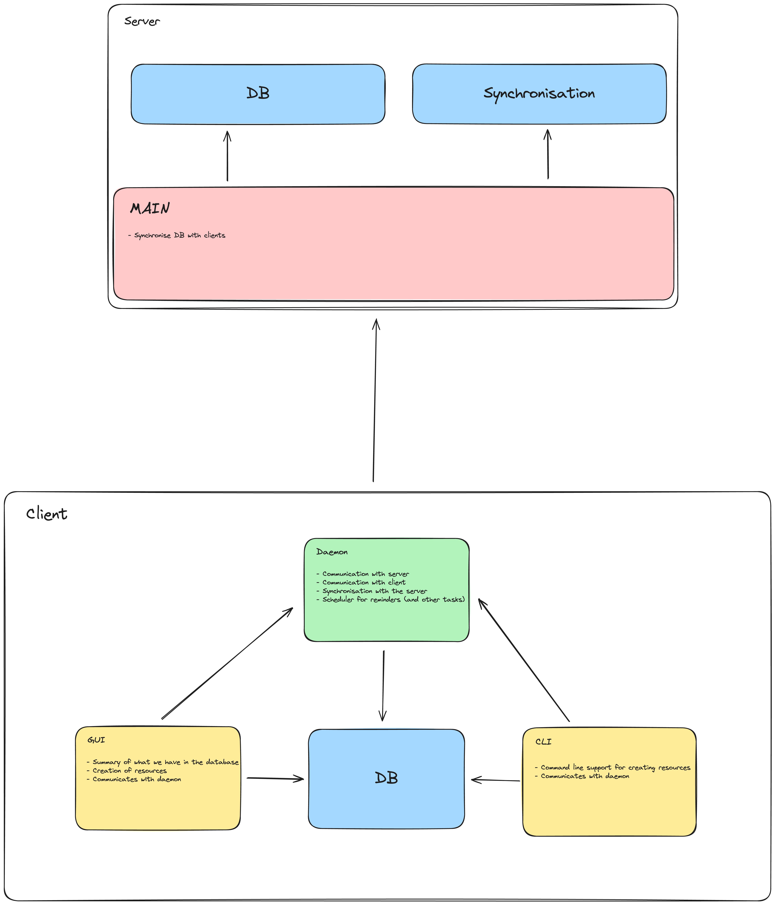

# HKB (Holy Kern Base)

An application dedicated to learn Rust and to simplify my daily workflow.

## Reasons 

- Improve my knowledge in Rust
- Focusing to build something to a stable version
- Simplify managing custom tools written in a script through my work years
- Learn networking
- Learn hot to do synchronisations  

## High level diagram

